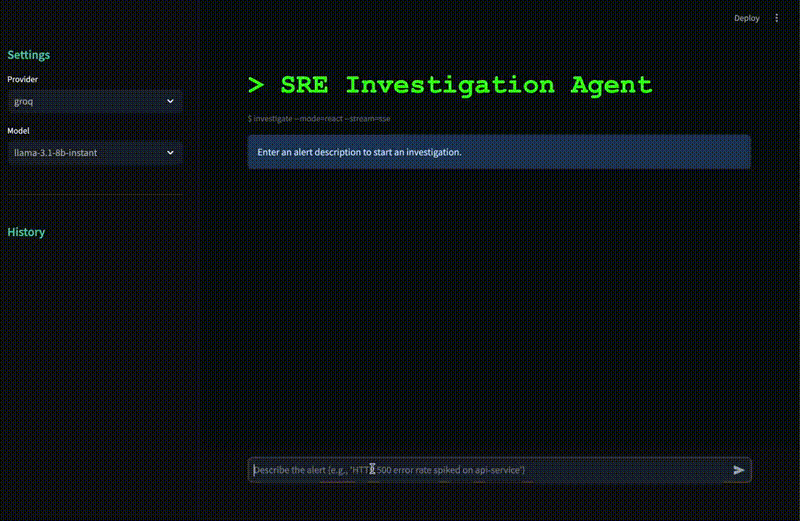

# SRE Incident Investigation Agent

AI agent that investigates production incidents using a ReAct (Reason + Act) loop. Built from scratch, no agent frameworks.

The agent receives an alert, forms hypotheses, queries Prometheus metrics and container logs through function calling, and produces a structured investigation report with root cause, evidence, and recommendations. Everything streams in real-time via SSE.



## How It Works

```
Alert (user input)
        |
        v
  ReAct Loop (agent.py)
  ┌─────────────────────────────┐
  │ 1. LLM thinks (hypothesis)  │
  │ 2. LLM picks a tool         │──► Tools (tools.py)
  │ 3. Tool returns data        │    ├── query_metrics (Prometheus)
  │ 4. LLM interprets           │    ├── get_container_logs
  │ 5. Repeat or conclude       │    ├── get_service_health
  └─────────────────────────────┘    ├── get_recent_deployments
        |                            ├── read_config
        v                            └── list_services
  Investigation Report
  (root cause + evidence + recommendation)
```

The agent uses OpenAI-compatible function calling (not text parsing) to select tools. No LangChain, no CrewAI.

## Quick Start

```bash
cp .env.example .env
# Add your GROQ_API_KEY or OPENAI_API_KEY to .env

docker compose up --build
```

Wait ~30 seconds for Prometheus to collect metrics, then open:

- **UI**: http://localhost:8501
- **API**: http://localhost:8000/docs
- **Prometheus**: http://localhost:9090

## Example Alerts

Try these in the UI:

- "HTTP 500 error rate spiked on api-service"
- "Response times are very slow on the users endpoint"
- "Database connection errors on api-service"

The simulated infrastructure cycles through failure scenarios automatically every 2 minutes: normal, high error rate (70% 500s), slow responses (2-5s delay), database connection failures.

## Architecture

- **Agent loop** (`agent.py`): Non-streaming LLM calls with tool definitions. Parses `tool_calls` from the response, executes them, appends results, loops. Max 8 iterations, 3 tool calls per iteration.
- **Tools** (`tools.py`): 6 read-only tools that query Prometheus and service admin endpoints. Results truncated to avoid token bloat.
- **SSE streaming** (`main.py`): Generator yields typed events (`thought`, `tool_call`, `tool_result`, `conclusion`, `done`).
- **Simulated infra** (`infra/`): FastAPI service with Prometheus metrics, controllable failure modes, and a traffic generator that injects failures on a schedule.
- **History** (`history.py`): SQLite stores past investigations with full event replay.

## Supported Providers

| Provider | Models |
|----------|--------|
| Groq | llama-3.3-70b-versatile, llama-3.1-8b-instant |
| OpenAI | gpt-4o, gpt-4o-mini |

Both use the same OpenAI-compatible function calling API. Switch providers in the UI sidebar.

## Project Structure

```
sre-agent/
├── app/
│   ├── main.py        FastAPI + SSE streaming
│   ├── agent.py       ReAct loop + function calling
│   ├── tools.py       Tool definitions + implementations
│   ├── config.py      Settings, providers, system prompt
│   ├── ui.py          Streamlit UI
│   └── history.py     SQLite investigation history
├── infra/
│   ├── app.py         Simulated service with failure modes
│   ├── traffic.py     Traffic generator + failure injection
│   └── prometheus.yml Scrape config
├── docker-compose.yml
├── Dockerfile
└── Dockerfile.infra
```

## Design Decisions

**No agent frameworks.** LangChain, CrewAI, and similar frameworks add abstraction layers that obscure what's happening. The entire ReAct loop here is one function with a for-loop. You can read it, debug it, and extend it without fighting the framework.

**Non-streaming LLM calls inside the loop.** Tool calls need to be parsed from the complete response. Streaming would require buffering the entire response anyway when `tool_calls` are present. The SSE stream to the UI provides the real-time experience.

**Read-only tools.** Auto-remediation is dangerous without guardrails. Investigation is the hard part. Once you know the root cause, the fix is usually straightforward. This keeps the agent safe to run against real systems.

**Simulated infrastructure.** Real infrastructure requires real credentials and real problems. The simulated setup lets anyone clone, build, and see the agent investigate realistic scenarios in under a minute.

## API

### POST /investigate

Start an investigation. Returns SSE stream.

```bash
curl -N -X POST http://localhost:8000/investigate \
  -H "Content-Type: application/json" \
  -d '{"alert": "HTTP 500 errors on api-service", "provider": "groq"}'
```

### GET /providers

List available LLM providers and models.

### GET /history

List past investigations.

### GET /investigations/{id}

Get full investigation with all events.
